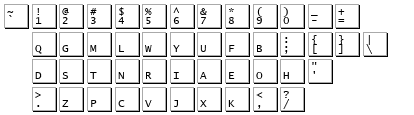

======
 .ZCP
======

An ergonomic keyboard layout.

TL;DR: `Here <layout-picture_>`_ is the layout.

Who am I?
=========

My name is Philippe Daouadi. I am a French developer, and I like typing comfortably.

I started learning touch typing (typing without looking at the keyboard) around
10 years ago with the French azerty layout. Some time later, I discovered that a
lot of better keyboard layouts existed. At the time I used to type a lot of
French, so after some thinking and a lot of motivation, I decided on learning
the BÉPO layout which is a kind of French Dvorak.

While I was interested in layouts, I got interested in keyboards too. My first
ergonomic keyboard was a `TypeMatrix <http://typematrix.com>`_. I kept using
that BÉPO+TypeMatrix configuration for maybe 7 years.

My only regret with TypeMatrix was that they didn't make mechanical keyboards. I
had a look at the `Truly Ergonomic Mechanical Keyboard
<https://www.trulyergonomic.com/store/truly-ergonomic-mechanical-keyboard-soft-tactile-kailh-cherry-mx-compatible-brown-keyswitches-229-english>`_
but really disliked the key positioning.

But recently, a coworker bought an `Ergodox EZ <https://ergodox-ez.com>`_, he
kindly let me try it, and that's when I fell in love with it!

After having bought my new keyboard, I thought to myself that since French is
not the language I type the most anymore, and since I need to learn to use a new
keyboard anyway, I might as well learn a new layout.

I did some research and concluded that the candidates were:

- Dvorak
- Colemak
- Workman
- the carpalx layouts

The last one is actually more interesting than the others. The carpalx layouts
are machine-generated layouts.

`This article
<http://pinouchon.github.io/keyboard/layouts/2016/03/07/layouts-review-dvorak-vs-colemak-vs-carpalx-vs-workman.html>`_
convinced me to try out a carpalx layout, and so I switched to the QGMLWB
layout.

The carpalx project
===================

The `carpalx project <http://mkweb.bcgsc.ca/carpalx/>`_ is not a keyboard
layout.  It is a small Perl program that, according to a typing model, tries to
find the most optimized layout for a given word set.

Carlpax gave birth to three main layouts:

- QFMLWY
- QGMLWB
- QGMLWY

After about an hour testing and learning QGMLWB, the most optimized one, I
realised that maybe we could do better.

Carpalx starts optimizing from the QWERTY layout and doesn't try to optimize
symbols placement. This means that all symbols that are at the bottom right of
the keyboard are stuck there, even though they are rarely used keys occupying
easily accessible spots. The QGMLWB layout tries to help with that by swapping
the 'P' and ';' keys.

Moreover, looking into the carpalx code, I noticed that the typing model assumed
the keyboard was standard, with keys disposed in diagonal, as opposed to
ergonomic keyboards where keys are disposed as a matrix (as vertical colums).

It was time to create a new layout!

Making a new layout
===================

So I started with the carpalx project, and I first changed the model to adapt to
matricial keyboards. The means that typing a 'T' or a 'Y' on a QWERTY keyboard
takes the same effort, as the keys are at the same distance from the home row.

Next come the symbols. They are harder to optimize than the letters. We could
optimize them in the same way as the letters but as I am a developper, the
English language is not representative of what I type. And no programing
language really is because I regularly use quite a few of them.

I made a compromise here and used carpalx to optimize only '.' and ',' because
they occupy easy to access spots and I was sure that some letters would benefit
more from these spots. I also moved ';' on 'P' position, as did the QGMLWB
layout.

I didn't try to optimize characters as '[' and ']' as it would not make much
sense in English. Also they already are in difficult spots so it's better to
keep them there, as to ease transition from other layouts.

An ergonomic keyboard layout: .ZCP
==================================

The new layout that came out is actually very similar to carpalx layouts. I
named it ".ZCP" (I pronounce it dot-zi-ci-pi, if it's of any matter). The name
comes from the third line of the layout because the first line starts exactly
like one of the carpalx original layouts and because I find this name much
easier to remember.

The features of this layout are:

- it's optimized for English typing with matricial keyboards (but is still
  pretty good for standard layouts)
- basic punctuation is optimized too
- it's a direct remap of QWERTY (like other English layouts)

.. _layout-picture:

Here is the layout:

According to the modified typing model, the different keyboards give the
following effort scores:

======== =======
Layout   Effort
======== =======
.zcp     1.656
qgmlwb   1.664
colemak  1.834
workman  1.991
dvorak   2.096
qwerty   3.007
======== =======

Download the layout
===================

The X11 layout is in this repository.

Load it with:

.. code-block:: shell

  setxkbmap dot-zcp -print | xkbcomp -Ix11 - $DISPLAY

License
=======

.. image:: https://i.creativecommons.org/l/by/4.0/80x15.png
    :target: http://creativecommons.org/licenses/by/4.0/
    :alt: Creative Commons License

All this work is licensed under a `Creative Commons Attribution 4.0
International License <http://creativecommons.org/licenses/by/4.0/>`_.
